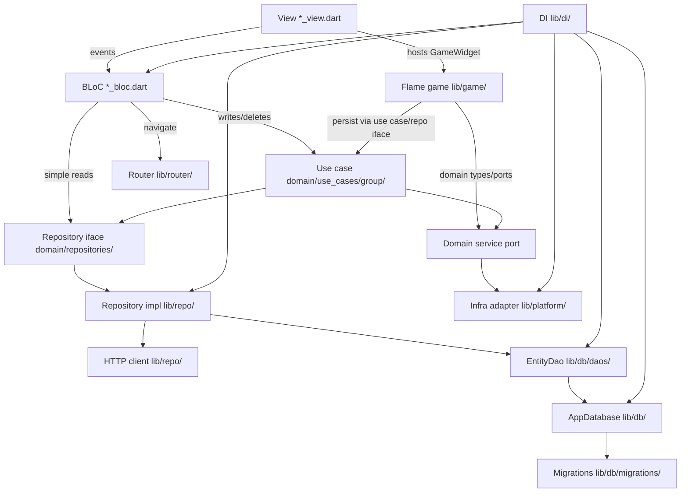

# Architecture — Tower Up

Tower Up is a Flutter tower-defense game with local saves (Flame). It uses a
layered architecture: the domain stays pure (no Flutter / Flame / UI / DB /
plugins), and every other layer depends inward. Presentation and the Flame game
talk to use cases and repository interfaces; concrete I/O lives in `repo/`,
`db/`, and `platform/`.

## Layers

Order layers from innermost (most pure, fewest dependencies) to outermost.

| Layer | Directory | Responsibility | May depend on |
|-------|-----------|----------------|---------------|
| Domain | `lib/domain/` | Entities, models, repository interfaces, service ports, use cases (grouped under `use_cases/`), non-trivial logic under `business/` when extracted from use cases, formatters, validators. Pure — no Flutter or Flame. | (nothing internal) |
| Data-access | `lib/repo/` | Repository implementations that fulfil domain interfaces (including local save persistence). | Domain, DB |
| Persistence | `lib/db/` | Connection (`AppDatabase`), schema, migrations, DAOs — one DAO per table/aggregate. | Domain |
| Infra adapters | `lib/platform/` | OS/plugin adapters implementing domain service ports. | Domain |
| Game | `lib/game/` | Flame `FlameGame`, components, overlays. May use domain types and ports; hosts gameplay loop. | Domain |
| Presentation | `lib/screens/` | Menu/HUD shells + BLoCs. Views render; BLoCs hold logic and navigation. Host `GameWidget` where needed. | Domain, router, di, theme, logger |
| Cross-cutting | `lib/router/`, `lib/di/`, `lib/theme/`, `lib/logger/` | Routing, dependency injection, design tokens (`TowerTheme` / spacing / radius / text styles), shared logger. | Domain + presentation as needed |

## Core rules

1. **BLoC** performs writes/deletes through a **use case** and simple reads
   through a **repository** (domain interface).
2. **All navigation happens in BLoCs** — never in views or shared widgets.
   Every screen must be registered with a route in `lib/router/`. Views only
   dispatch events (e.g. `backTapped`); the BLoC navigates by calling the
   registered router API. Views must not import the router or `go_router`.
3. **No infrastructure in BLoCs or views** — infrastructure is reached only
   through domain ports implemented in `lib/platform/` / `lib/repo/`. Do not
   use `sqflite`, `path_provider`, `shared_preferences`, raw Flame engine
   wiring beyond injecting a domain-facing game port, or `http` from BLoCs/views.
4. **The domain is pure** — it must not import any outer layer, Flutter, or
   Flame.
5. **API HTTP calls** (when added) are made from `lib/repo/` or `lib/platform/`
   (not from controllers/views). Completion logging is centralized in the shared
   HTTP client — see AGENTS.md for format (`Success …` / `Failed …`; `logger.i` /
   `logger.w`). Temporary diagnostic logs: `logger.d` only — remove before
   finishing.
6. **Database exceptions are always caught** — at `lib/db/` (open, migrations,
   DAOs) and at any other call site that talks to the DB. Never leave them
   uncaught. On app startup, wrap DB init in `try`/`catch`; on failure log with
   `logger.w` and `runApp` a fatal-error screen only — do not enter the main UI.
   See `docs/agent-guidelines/07-database-exceptions.md`.
7. **Flame gameplay** lives under `lib/game/`. Persist progress through use
   cases / repository interfaces (local saves), not by opening SQLite from game
   code. See https://docs.flame-engine.org/latest/README.html.

## Logger setup

Centralize the `logger` package in `lib/logger/logger.dart`. Configure
`PrettyPrinter` with a short stack trace from the log call site:

```dart
import 'package:logger/logger.dart';

final logger = Logger(
  printer: PrettyPrinter(
    methodCount: 1,
    errorMethodCount: 1,
    lineLength: 120,
  ),
);
```

## Strict import table

This is the authoritative deny-list. Planned enforcement artifacts
(`towerup_lint_rules` and `test/architecture/layer_import_test.dart`) will
encode exactly this table when created; until then the table alone is the
source of truth.

- **`lib/domain/**`** must not import: `package:flutter/`, `package:flame/`,
  `package:towerup/screens/`, `package:towerup/game/`, `package:towerup/repo/`,
  `package:towerup/db/`, `package:towerup/platform/`, `package:towerup/router/`,
  `package:towerup/di/`, `package:towerup/theme/`, `package:flutter_bloc/`,
  `package:go_router/`.
- **`lib/repo/**`** must not import: `package:flutter/`, `package:flame/`,
  `package:towerup/screens/`, `package:towerup/game/`, `package:towerup/router/`,
  `package:towerup/di/`, `package:flutter_bloc/`, `package:go_router/`.
- **`lib/db/**`** must not import: `package:flutter/`, `package:flame/`,
  `package:towerup/screens/`, `package:towerup/game/`, `package:towerup/repo/`,
  `package:towerup/router/`, `package:towerup/di/`, `package:flutter_bloc/`,
  `package:go_router/`.
- **`lib/platform/**`** must not import: `package:towerup/screens/`,
  `package:towerup/game/`, `package:towerup/repo/`, `package:towerup/db/`,
  `package:towerup/router/`, `package:towerup/di/`, `package:flutter_bloc/`,
  `package:go_router/`.
- **`lib/game/**`** must not import: `package:towerup/repo/`,
  `package:towerup/db/`, `package:towerup/di/`, `package:towerup/router/`,
  `package:flutter_bloc/`, `package:go_router/`.
- **Views (`*_view.dart`)** must not import: `package:towerup/repo/`,
  `package:towerup/db/`, `package:towerup/router/`, `package:towerup/di/`,
  `package:go_router/`.
- **Controllers (`*_bloc.dart` / `*_event.dart` / `*_state.dart`)** must not
  import: `package:towerup/repo/`, `package:towerup/db/`, `package:go_router/`,
  `package:sqflite/`, `package:path_provider/`, `package:shared_preferences/`,
  `package:http/`.
- **Shared components (`lib/screens/components/**`)** must not import:
  `package:towerup/repo/`, `package:towerup/db/`, `package:towerup/router/`,
  `package:towerup/di/`, `package:flutter_bloc/`, `package:go_router/`.

## Data flow



Domain interfaces (`Repo`, `Port`, `UseCase`) live in the domain layer;
`RepoImpl` and `Platform` implement them from outer layers and are wired in
`lib/di/`. Repository impls call **DAOs** (not raw `Database`); DAOs return
domain entities directly. The game layer uses domain types/ports and must not
open SQLite itself.

## Remote DTOs

JSON DTOs (`json_serializable`) belong in the repo/HTTP path when remote APIs
exist. Map to domain entities before crossing into controllers. DAOs continue to
own SQL and return domain entities — see
`docs/agent-guidelines/03-serialization.md`.

### Persistence layout (`lib/db/`)

```
lib/db/
├── app_database.*          # connection, version, transaction()
├── schema/tables.*         # CREATE TABLE DDL
├── migrations/             # incremental upgrade steps
└── daos/<entity>_dao.*     # one DAO per table — SQL CRUD
```

- **`AppDatabase`** — open/close, `onCreate`/`onUpgrade`, `transaction()` for
  cross-DAO writes. No per-table queries.
- **`<Entity>Dao`** — table-specific SELECT/INSERT/UPDATE/DELETE; maps query
  results to domain entities.
- **Repository impls** — the only callers of DAOs; may combine local DAO data
  with remote HTTP responses when APIs exist.

### Read path (example)

1. BLoC calls `SaveRepository.getById(id)` (domain interface).
2. `SaveRepositoryImpl` calls `SaveDao.findById(id)` → domain `Save`.
3. Impl may merge remote data via HTTP before returning (when applicable).
4. BLoC receives domain type only.

### Write path (example)

1. BLoC (or game via use case) dispatches to `CreateOrUpdateSaveUseCase`.
2. Use case calls `SaveRepository.save(save)`.
3. `SaveRepositoryImpl` calls `SaveDao.upsert(save)`.
4. Cross-table write: `AppDatabase.transaction((db) async { ... })` with DAOs
   receiving the transactional `db` handle.

### Example snippets

`app_database.*` — connection shell only (callers must catch; open can throw):

```dart
class AppDatabase {
  static const _version = 1;
  Database? _db;

  Future<Database> get database async => _db ??= await _open();

  Future<Database> _open() async { /* sqflite openDatabase / onCreate / onUpgrade */ }

  Future<T> transaction<T>(Future<T> Function(Database db) action) async {
    final db = await database;
    return db.transaction((txn) => action(txn));
  }
}
```

`main.*` — wrap startup DB init; on failure show fatal-error screen only:

```dart
Future<void> main() async {
  WidgetsFlutterBinding.ensureInitialized();
  try {
    await configureDependencies(); // opens / registers AppDatabase
  } on DatabaseException catch (e, st) {
    logger.w('Failed opening database on startup', error: e, stackTrace: st);
    runApp(const DatabaseFatalApp());
    return;
  }
  runApp(const TowerUpApp());
}
```

`daos/save_dao.*` — per-table CRUD (illustrative):

```dart
class SaveDao {
  SaveDao(this._appDb);
  final AppDatabase _appDb;

  Future<List<Save>> findAll({Database? db}) async { ... }
  Future<void> upsert(Save save, {Database? db}) async { ... }
}
```

`repo/save_repository_impl.*` — orchestrates DAO (+ HTTP when present):

```dart
class SaveRepositoryImpl implements SaveRepository {
  SaveRepositoryImpl(this._saveDao);
  final SaveDao _saveDao;

  @override
  Future<List<Save>> getAll() async {
    return _saveDao.findAll();
  }
}
```

`di/di.*` — split registration into private helpers (`_registerSingletons`,
`_registerUseCases`, `_registerScreens`, …), group entries with section
comments (e.g. `// save use cases`), and call those helpers from one public
startup method run from `main` before `runApp`. Inside `_registerSingletons`,
order is AppDatabase → DAOs → repository impls / platform adapters:

```dart
Future<void> configureDependencies() async {
  _registerSingletons();
  _registerUseCases();
  _registerScreens();
}

void _registerSingletons() {
  // database
  getIt.registerLazySingleton<AppDatabase>(() => AppDatabase());
  getIt.registerLazySingleton<SaveDao>(() => SaveDao(getIt()));

  // save repos
  getIt.registerLazySingleton<SaveRepository>(
    () => SaveRepositoryImpl(getIt()),
  );
}

void _registerUseCases() {
  // save use cases
  getIt.registerLazySingleton(() => CreateOrUpdateSaveUseCase(getIt()));
}

void _registerScreens() {
  // menu screens
  getIt.registerFactory(() => MainMenuBloc(getIt()));
}
```

## Changing a boundary

A boundary change is a three-file change, all in the same commit (when
enforcement artifacts exist):

1. Update the **Strict import table** above.
2. Update the deny-lists in `towerup_lint_rules` (see
   [enforcement.md](enforcement.md)).
3. Update / re-run `test/architecture/layer_import_test.dart`.

Until those artifacts exist, update this table and `docs/enforcement.md` in the
same change. If they disagree, the table wins and the other two are bugs.
